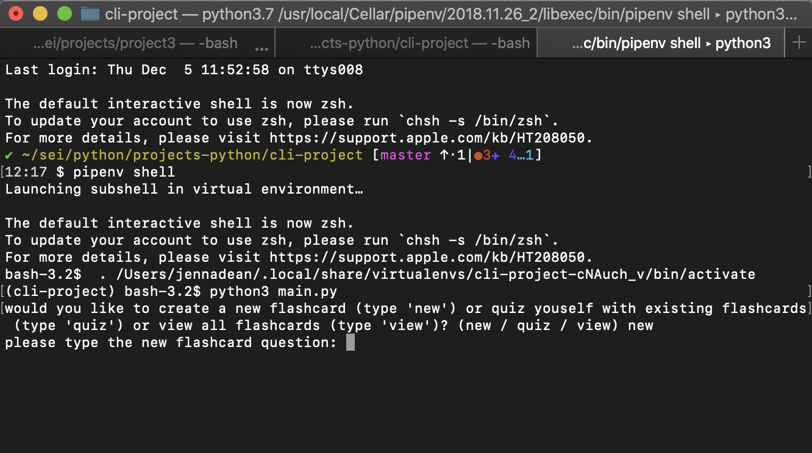

# Python Flashcards

## Create and / or Test Yourself using these flashcards in the Command Line

### How to Get Started

1. Fork and clone this repository
2. install dependencies
   - in terminal, use command `pipenv install`
3. Run the file in your command line
   - in the command line under the directory that was cloned, run the command `pipenv run python main.py`
4. Play the Game

## Using the Application

The application will prompt you if you want to quiz yourself with the flashcards already created, or ask if you would like to create a new flashcard, and you can answer in whatever way is going to make you the happiest!
